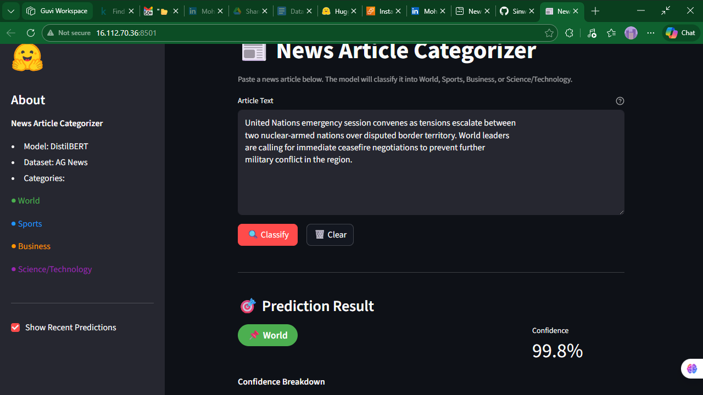
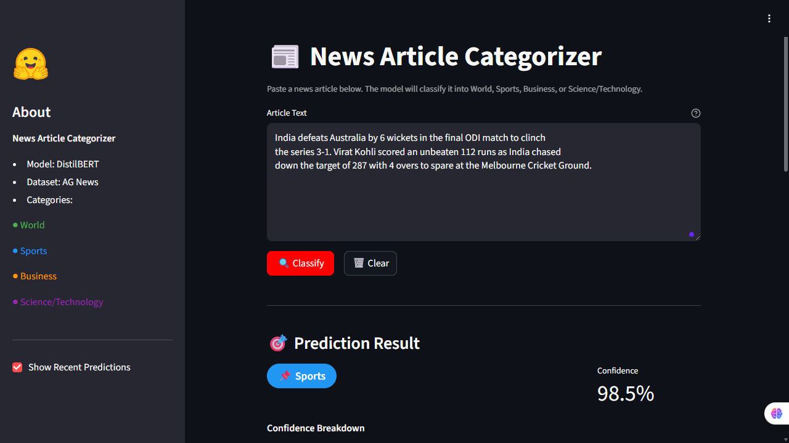
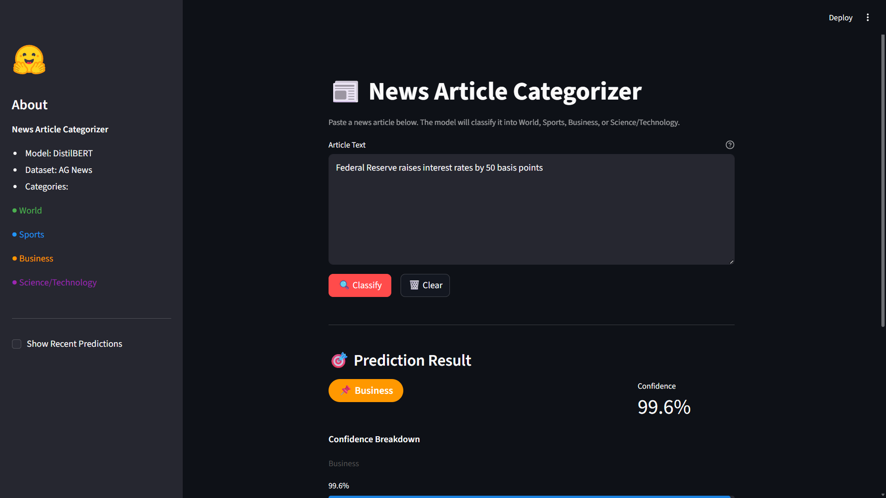
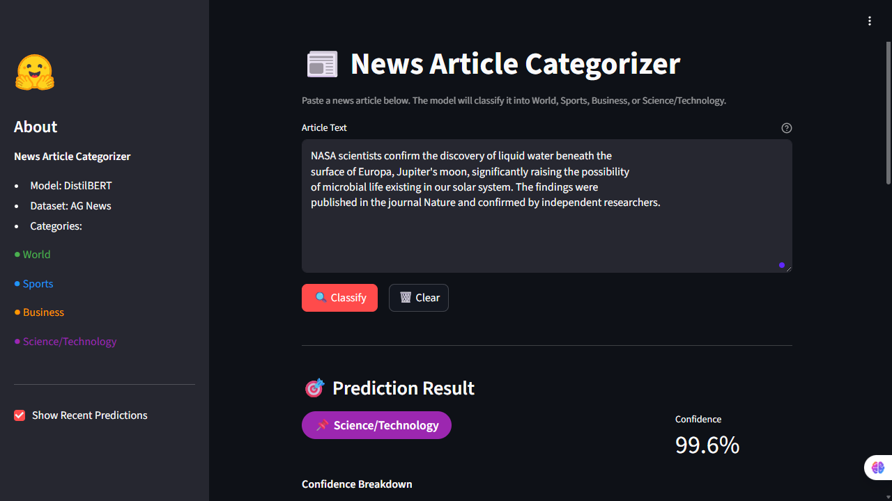

# 📰 News Article Categorization System
🌐 Live Demo: http://16.112.70.36:8501


An end-to-end production-ready **News Article Categorization System** that fine-tunes DistilBERT on the AG News dataset to classify articles into 4 categories, served via a Streamlit web app, deployed on AWS EC2, with predictions logged to PostgreSQL RDS.

---

## Problem statement
News platforms process millions of articles daily. Manual categorization doesn't scale. This system automates that using a fine-tuned transformer, achieving 94.62% accuracy across 4 categories on the AG News benchmark.

---
## 📸 App Screenshot






---

## 🎯 Categories

| Label | Examples |
|---|---|
| 🌍 World | Politics, international events, conflicts |
| ⚽ Sports | Football, cricket, Olympics, match results |
| 💼 Business | Markets, earnings, economy, startups |
| 🔬 Science/Technology | AI, space, research, product launches |

---

## 🏗️ Architecture

```
User → Streamlit UI (EC2 :8501)
           │
           ▼
     inference.py  ──→  DistilBERT model
           │             (loaded from S3 on startup)
           ▼
      db_utils.py  ──→  PostgreSQL RDS
                         (logs every prediction)
```

---

## 📁 Project Structure

```
news-categorization/
├── src/
│   ├── __init__.py
│   ├── data_preprocessing.py   # AG News loading, cleaning, tokenization
│   ├── train.py                # Fine-tuning pipeline
│   ├── inference.py            # Prediction + confidence scores
│   ├── aws_utils.py            # S3 upload/download
│   └── db_utils.py             # PostgreSQL connection pool + logging
├── tests/
│   ├── __init__.py
│   └── test_inference.py       # Unit tests
├── sql/
│   └── schema.sql              # RDS table schema + views
├── scripts/
│   └── deploy.sh               # EC2 deployment script
├── app.py                      # Streamlit frontend
├── config.py                   # Centralized configuration
├── requirements.txt
└── README.md
```

---

## 📊 Model Performance

| Metric | Subset (2K rows) | Full Training (120K rows) |
|---|---|---|
| Accuracy | 88.0% | **94.62%** |
| Eval Loss | 0.4156 | **0.1661** |
| Training Time | ~16 min (CPU) | ~2 hrs (CPU) |
| Model Size | — | 247 MB |

**Base Model:** `distilbert-base-uncased`  
**Dataset:** AG News (120K train / 7.6K test)  
**Hardware:** CPU (no GPU required)

---

## ⚡ Quick Start (Local)

### 1. Clone & Install
```bash
git clone https://github.com/Sinwansiraj/DEPLOYMENT_OF_NEWS_ARTICLE.git
cd DEPLOYMENT_OF_NEWS_ARTICLE
python -m venv venv

# Windows
venv\Scripts\activate

# Linux/Mac
source venv/bin/activate

pip install -r requirements.txt
```

### 2. Configure Environment
Create a `.env` file in the project root:
```bash
AWS_REGION=ap-south-2
S3_BUCKET=your-s3-bucket-name
AWS_ACCESS_KEY_ID=your_key        # leave blank if using IAM role
AWS_SECRET_ACCESS_KEY=your_secret # leave blank if using IAM role
DB_HOST=your-rds-endpoint.rds.amazonaws.com
DB_PORT=5432
DB_NAME=news_categorizer
DB_USER=postgres
DB_PASSWORD=your_password
```

### 3. Train the Model
```bash
# Quick smoke test (2000 rows, ~15 min on CPU):
python -m src.train --subset 2000 --no-s3

# Full training (120K rows, ~19 hrs on CPU):
python -m src.train
```

### 4. Run the App
```bash
streamlit run app.py --server.fileWatcherType none
# Open http://localhost:8501
```

### 5. Run Tests
```bash
pytest tests/ -v
```

---

## ☁️ AWS Deployment

### Prerequisites
- AWS account with S3 bucket created
- RDS PostgreSQL instance (db.t3.micro)
- EC2 instance (t3.micro with 2GB swap, Ubuntu 22.04)
- IAM role with `AmazonS3ReadOnlyAccess` attached to EC2

### EC2 Security Group Rules
| Type | Port | Source |
|---|---|---|
| SSH | 22 | Your IP |
| Custom TCP | 8501 | 0.0.0.0/0 |

### RDS Security Group Rules
| Type | Port | Source |
|---|---|---|
| PostgreSQL | 5432 | Your IP (local dev) |
| PostgreSQL | 5432 | EC2 Security Group ID |

### Deploy on EC2
```bash
# SSH into EC2
ssh -i your-key.pem ubuntu@<EC2-PUBLIC-IP>

# Setup swap (required for t3.micro)
sudo fallocate -l 2G /swapfile
sudo chmod 600 /swapfile
sudo mkswap /swapfile
sudo swapon /swapfile
echo '/swapfile none swap sw 0 0' | sudo tee -a /etc/fstab

# Clone and install
git clone https://github.com/Sinwansiraj/DEPLOYMENT_OF_NEWS_ARTICLE.git
cd DEPLOYMENT_OF_NEWS_ARTICLE
python3.11 -m venv venv && source venv/bin/activate
pip install -r requirements.txt

# Configure environment
nano .env   # add your credentials

# Launch app
nohup venv/bin/streamlit run app.py \
  --server.port 8501 \
  --server.headless true \
  --server.address 0.0.0.0 \
  --server.fileWatcherType none \
  > streamlit.log 2>&1 &
```

App will be live at: 🌐 Live Demo: http://16.112.70.36:8501

---

## 🗄️ Database Schema

```sql
CREATE TABLE predictions (
    id              SERIAL PRIMARY KEY,
    input_text      TEXT NOT NULL,
    predicted_label VARCHAR(64) NOT NULL,
    confidence      FLOAT NOT NULL,
    all_scores      JSONB,
    model_version   VARCHAR(128) DEFAULT 'v1.0',
    created_at      TIMESTAMPTZ NOT NULL DEFAULT NOW()
);
```

Includes two analytical views:
- `category_stats` — prediction count and avg confidence per category
- `daily_prediction_volume` — daily request volume over time

---

## 🔧 Environment Variables

| Variable | Description |
|---|---|
| `AWS_REGION` | AWS region (e.g. `ap-south-2`) |
| `S3_BUCKET` | S3 bucket name |
| `AWS_ACCESS_KEY_ID` | AWS key (blank if using IAM role on EC2) |
| `AWS_SECRET_ACCESS_KEY` | AWS secret (blank if using IAM role on EC2) |
| `DB_HOST` | RDS endpoint URL |
| `DB_PORT` | PostgreSQL port (default: `5432`) |
| `DB_NAME` | Database name |
| `DB_USER` | DB username |
| `DB_PASSWORD` | DB password |

---

## 🧪 Sample Predictions

| Input | Predicted | Confidence |
|---|---|---|
| Apple launches new iPhone with breakthrough AI chip | Science/Technology | 97.5% |
| Jadeja, who played for CSK for 12 seasons,having played over 250 games | Sports | 99.7% |
| Federal Reserve raises interest rates by 50 bps | Business | 99.6% |
| NASA discovers water ice beneath Mars surface | Science/Technology | 98.7% |
| Tesla reports record quarterly revenue | Business | 93.6% |

---

## 🛠️ Tech Stack

| Component | Technology |
|---|---|
| Model | DistilBERT (Hugging Face Transformers) |
| Training | Hugging Face Trainer API |
| Dataset | AG News (via Hugging Face Datasets) |
| Frontend | Streamlit |
| Model Storage | AWS S3 |
| Compute | AWS EC2 (Ubuntu 22.04) |
| Database | PostgreSQL on AWS RDS |
| DB Driver | psycopg2 |
| AWS SDK | boto3 |
| Language | Python 3.11 (PEP8 compliant) |

---

## 👤 Author

**Sinwan Siraj**  
Machine Learning Engineer  
📍 Coimbatore, Tamil Nadu  
🔗 [GitHub](https://github.com/Sinwansiraj/DEPLOYMENT_OF_NEWS_ARTICLE)
🔗 [Email](sinwanmohammed022@gmail.com)
🔗 [LinkedIN](https://www.linkedin.com/in/mohammed-sinwan-07b410162)

---

## 📄 License

This project is licensed under the MIT License.
