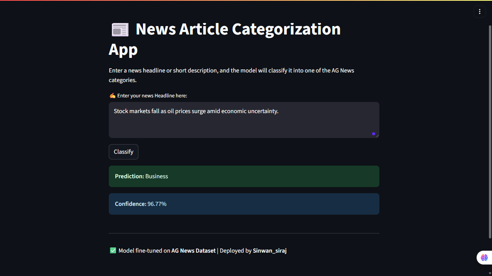
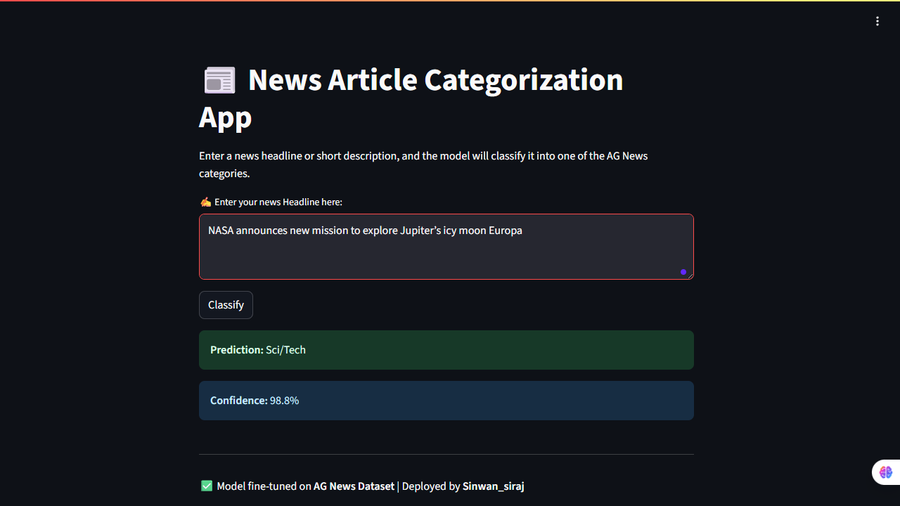
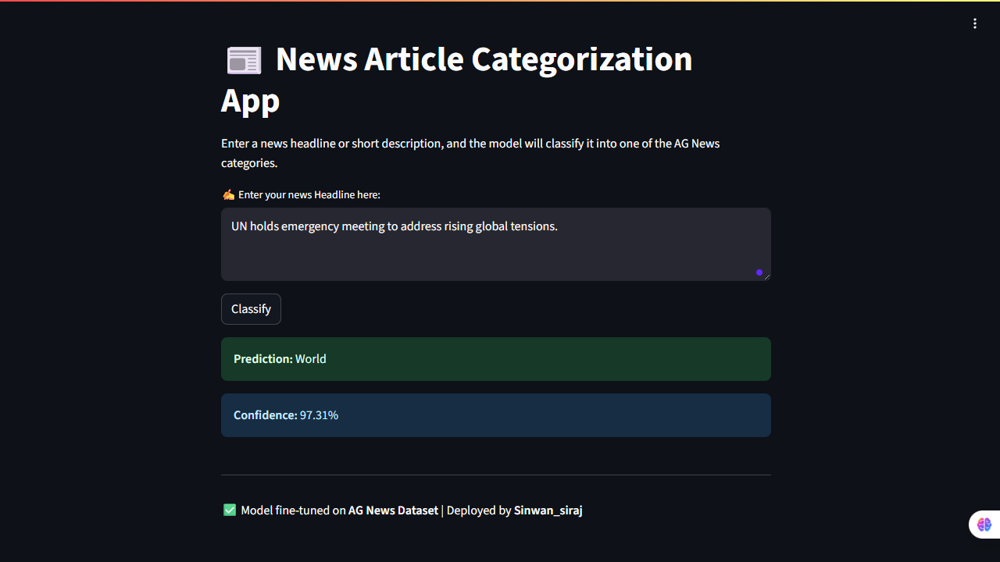

# 📰 Deployment of News Article Categorization

This project is a **News Article Categorization Application** that uses a fine-tuned NLP model to classify news articles into categories such as Business, Sports, Technology, and World.  
The application is deployed using **Streamlit** and **AWS (S3, EC2)** for production readiness.

---

## 🚀 Features
- Fine-tuned Transformer model (e.g., BERT / RoBERTa) for text classification  
- User-friendly **Streamlit web interface** for article input  
- AWS integration (S3 for model storage, EC2 for hosting)  
- Dockerized environment (optional, for portability)  
- Supports real-time predictions  

---

## 🖼️ Preview
Here’s a preview of the application interface:
| BUSINESS  | SPORTS | SCI/TECH | WORLD |
|-----------|----------------|-------------------|------------------|
|  |  |  |  |


---

## 📂 Project Structure
```bash
news_deployment/
│── app.py                # Streamlit application
│── model/                # Fine-tuned model (excluded in .gitignore)
│── requirements.txt      # Python dependencies
│── scripts/              # Helper scripts (data loading, preprocessing, etc.)
│── .gitignore            # Ignored files (venv, model, cache)
│── README.md             # Project documentation
